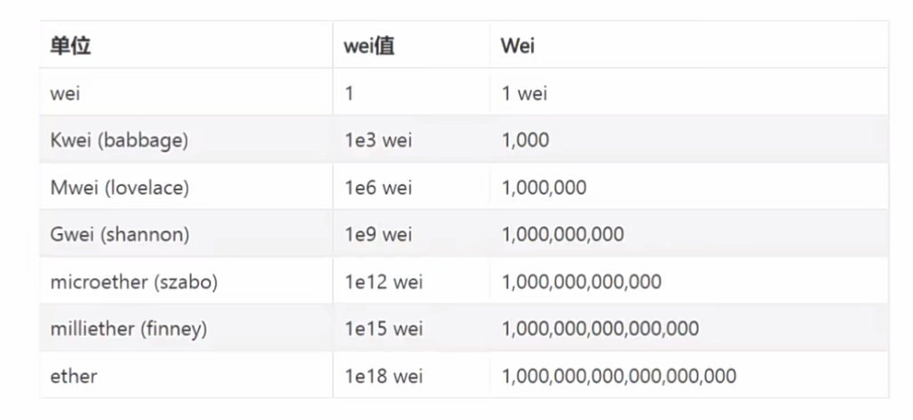

# Web3.0-DApp开发

- 讲师: 千峰- kerwin
- b站地址: https://www.bilibili.com/video/BV1Fd4y1x7jR/?spm_id_from=333.337.search-card.all.click

## 001 课程简介

## 002 初始web3.0

## 003 认识区块链

## 004 以太坊介绍

## 005 DApp简介

## 006 MetaMask

## 007 Ganache

## 008 Web3.js
> Web3.js是一个库，它有很多函数，使用它可以在以太坊生态系统中通过HTTP或IPC与本地或者以太坊远程节点交互，如查看链上信息等 

> 各种高级语言编写的程序可以使用web3 interface来与EVM交互，在此过程中使用是的JSON-RPC(一个无状态且轻量级的远程过程调用(RPC)传送协议，其传递内容透过JSON为主)

**您可以使用web3.is**来读取和写入以太坊区块链，而不是使用ajax从Web服务器读取和写入数据。

