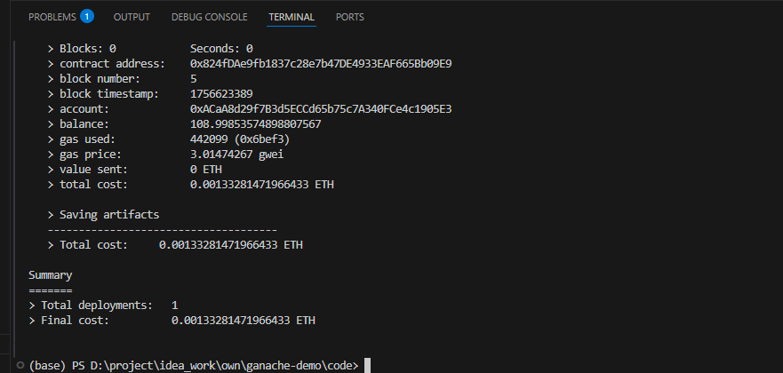

# Web3.0-DApp开发

- 讲师: 千峰- kerwin
- b站地址: https://www.bilibili.com/video/BV1Fd4y1x7jR/?spm_id_from=333.337.search-card.all.click

## 001 课程简介

## 002 初始web3.0

## 003 认识区块链

## 004 以太坊介绍

## 005 DApp简介

## 006 MetaMask

## 007 Ganache

## 008 Web3.js
**中文文档: https://learnblockchain.cn/docs/web3.js**
> Web3.js是一个库，它有很多函数，使用它可以在以太坊生态系统中通过HTTP或IPC与本地或者以太坊远程节点交互，如查看链上信息等 

> 各种高级语言编写的程序可以使用web3 interface来与EVM交互，在此过程中使用是的JSON-RPC(一个无状态且轻量级的远程过程调用(RPC)传送协议，其传递内容透过JSON为主)

**您可以使用web3.is**来读取和写入以太坊区块链，而不是使用ajax从Web服务器读取和写入数据。


所以web3.js依赖BigNumber Library1，且会自动进行引入。
核心代码
```html
<!DOCTYPE html>
<html lang="en">
<head>
    <meta charset="UTF-8">
    <meta name="viewport" content="width=device-width, initial-scale=1.0">
    <title>Document</title>
    <script src="https://cdn.jsdelivr.net/npm/web3@4.16.0/dist/web3.min.js"></script>
    
</head>
<body>

    <h1 id="title"></h1>

    <input type="text" id="toAccount">
    <button id="send">发送</button>

    <script>
        // 连接到以太坊网络
        // const web3 = new Web3('https://mainnet.infura.io/v3/your-infura-project-id');
        var web3 = new Web3(Web3.givenProvider || 'http://localhost:7545');
        // var web3 = new Web3(Web3.givenProvider || "ws://localhost:7545");

        web3.eth.getBlockNumber().then(res=>{
            console.log(res);
        });

        web3.eth.getChainId().then(res=>{
            console.log(res);
        });

        web3.eth.getBalance("0xACaA8d29f7B3d5ECCd65b75xxxxxxxxxx").then(res=>{
            console.log(res);
            // 转换单位
            console.log(web3.utils.fromWei(res, "ether"));
        });

        // 使用 promise
        // web3.eth.sendTransaction({
        //     from: '0x270871c6dc7bA8e8Dxxxxxxxxxxxx',
        //     to: '0xACaA8d29f7B3d5ECCd65b7xxxxxxxxxx',
        //     value: web3.utils.toWei("1", "ether")
        // })
        // .then(function(receipt){
        //     console.log("转完了!")
        // });

        // 先授权
        // web3.eth.requestAccounts().then(res=>{
        //     console.log("授权", res);

        //     title.innerHTML = res[0];
        // });

        // 获取账号

        web3.eth.getAccounts().then(res=>{            
            console.log('-----',res,'---===');
            title.innerHTML = res[0];
        });


        send.onclick = function(){
            // 获取输入框的值
            var toAccount = document.getElementById("toAccount").value;
            console.log(toAccount);

            // 转账
            web3.eth.sendTransaction({
                from: title.innerHTML,
                to: toAccount,
                value: web3.utils.toWei("1", "ether")
            })
            .then(function(receipt){
                console.log("转完了!")
            });
        }


    </script>
    
</body>
</html>
```

## 009 编写智能合约 - 入门

智能合约
- 1. Remix IDE
  > RemixIDE是开发以太坊智能合约的在线IDE工具，部署简单的智能合约非常方便Remixt址:https://remix.ethereum.org/
- 2.Truffle
   >Truffle是一个世界级的智能合约开发框架，专门为智能合约而生，
   ·管理智能合约的生命周期
   ·自动化合约测试
   。可编程，可部署，可发布合约
   ·不用过多的关注网络管理
   。强大的交互式控制台

目录结构:
- contracts/:存放solidity智能合约文件
- migrations/:truffle使用migration system 来控制合约的部署。
- test/:测试文件存放文字(javascript or solidity)
- truffle-config.js:配置文件


### solidity语言

####  3-1 数据位置
  solidity数据存储位置有三类:storage，memory和calldata。不同存储位置的gas成本不同。storage类型的数据存在链上，类似计算机的硬盘，消耗gas多;memory和caldata类型的临时存在内存里，消耗gas少。大致用法:
  - 1，storage:合约里的状态变量默认都是storage，存储在链上。
  - 2，memory:函数里的参数和临时变量一般用memory，存储在内存中，不上链。
  - 3，caldata:和memory类似，存储在内存中，不上链。与memory的不同点在于calldata变量不能修改(immutable)，一般用于函数的参数。

#### 3-2 作用域

变量的作用域:Solidity中变量按作用域划分有三种，分别是状态变量(state variable)，局部变量(local
variable)和全局变量(global variable)。
- 1，状态变量:状态变量是数据存储在链上的变量，所有合约内函数都可以访问，gas消耗高。状态变量在合约
内、函数外声明。可以在函数里更改状态变量的值:
- 2，局部变量:局部变量是仅在函数执行过程中有效的变量，函数退出后，变量无效。局部变量的数据存储在内存里，不上链，gas低。局部变量在函数内声明。
- 3，全局变量:全局变量是全局范围工作的变量，都是solidity预留关键字。他们可以在函数内不声明直接使用(类似于msg.sender,block.number)

**contract/StudentStorage.sol**

```javascript
pragma solidity >= 0.4.16 < 0.9.0;

contract StudentStorage {

    // 创建 2个变量，username,age
    string public name;
    uint public age;
    
    function setData(string memory _name, uint _age) public {
        // string memory a; // 局部变量，存储在内存中
        name = _name;
        age = _age;
    }

    // function test(uint x, uint y) public pure returns (uint) {
    //     return x + y;
    // }

    // view （视图函数，只访问不修改状态）， pure（纯函数，不访问，也不修改）
    function getData() public view returns (string memory, uint) {
        return (name, age);
    }

}
```

**执行编译**

```javascript
(base) PS D:\project\idea_work\own\ganache-demo\code> truffle compile

Compiling your contracts...
===========================
✓ Fetching solc version list from solc-bin. Attempt #1
✓ Downloading compiler. Attempt #1.
> Compiling .\contracts\StudentStorage.sol
> Compilation warnings encountered:

    Warning: SPDX license identifier not provided in source file. Before publishing, consider adding a comment containing "SPDX-License-Identifier: <SPDX-License>" to each source file. Use "SPDX-License-Identifier: UNLICENSED" for non-open-source code. Please see https://spdx.org for more information.
--> project:/contracts/StudentStorage.sol


> Artifacts written to D:\project\idea_work\own\ganache-demo\code\build\contracts
> Compiled successfully using:
   - solc: 0.8.21+commit.d9974bed.Emscripten.clang
(base) PS D:\project\idea_work\own\ganache-demo\code>
```
**部署**

执行部署命令（直接执行部署也会执行编译）: 
> truffle migrate


<br/>

**测试,进入控制台**


#### 3-3 脚本测试
- mocha测试
- truffle脚本

## 010 编写智能合约 - 进阶
contracts/StudentListStorage.sol
```solidity
pragma solidity >= 0.4.16 < 0.9.0;

contract StudentListStorage {

   // 结构体
    struct Student {
        uint id;
        string name;
        uint age;
    }

    // 动态数组
    Student[] public StudentList; // 自动gettter()

    // 创建 2个变量，username,age
    string  public name;
    uint public  age;
    
    // struct ，动态数组，映射，string
    function addList(string memory _name, uint _age) public returns (uint) {
        uint count = StudentList.length;
        uint index = count + 1;
        // string memory a; // 局部变量，存储在内存中
        StudentList.push(Student(index, _name, _age));
        return StudentList.length;
    }

    // function test(uint x, uint y) public pure returns (uint) {
    //     return x + y;
    // }

    // view （视图函数，只访问不修改状态）， pure（纯函数，不访问，也不修改）
    function getList() public view returns (Student[] memory) {
        Student[] memory list = StudentList;
        return list;
    }


}
```
**部署脚本:**
migrations/2_deploy.js

```solidity
const Contracts = artifacts.require("./StudentListStorage.sol");

module.exports = async function (callback) {
    // console.log("111111");
    // console.log("---------");
    const studentStorage = await Contracts.deployed();


    await studentStorage.addList("hufl", 20);
    let res = await studentStorage.getList();
    console.log(res);

    console.log(await studentStorage.StudentList(2));
    callback();
    
}
```
**测试脚本**
scripts/test2.js
```solidity

const Contracts = artifacts.require("./StudentListStorage.sol");

module.exports = async function (callback) {
    // console.log("111111");
    // console.log("---------");
    const studentStorage = await Contracts.deployed();


    await studentStorage.addList("hufl", 20);
    let res = await studentStorage.getList();
    console.log(res);

    console.log(await studentStorage.StudentList(2));
    callback();
    
}
```
执行测试脚本: 
> truffle exec scripts/test2.js


## 011 打通Web3.js到智能合约
> ABI非常类似于 API(应用程序接口)，一种人类可读的代码接口表示。ABI定义了用于与二进制合约交互的方法和结构，就像 API所做的那样，只是在较低的级别上。

```html
<!DOCTYPE html>
<html lang="en">
<head>
    <meta charset="UTF-8">
    <meta name="viewport" content="width=device-width, initial-scale=1.0">
    <title>Document</title>
    <script src="https://cdn.jsdelivr.net/npm/web3@4.16.0/dist/web3.min.js"></script>
    
</head>
<body>

    <input type="text" id="myname">

    <input type="number" id="myage">

    <button id="add">add</button>

    <ul id="list">

    </ul>

    <script type="module">
        // 连接到以太坊网络
        var web3 = new Web3(Web3.givenProvider || 'http://localhost:7545');
     
        // 先授权
        // let account = await web3.eth.requestAccounts();
        // console.log(account);

        let accounts = await web3.eth.getAccounts();
        console.log(accounts[0]);

        let account = accounts[0];
        
        // 连接智能合约程序
       var studentListStorage =  await new web3.eth.Contract([
    {
      "inputs": [
        {
          "internalType": "uint256",
          "name": "",
          "type": "uint256"
        }
      ],
      "name": "StudentList",
      "outputs": [
        {
          "internalType": "uint256",
          "name": "id",
          "type": "uint256"
        },
        {
          "internalType": "string",
          "name": "name",
          "type": "string"
        },
        {
          "internalType": "uint256",
          "name": "age",
          "type": "uint256"
        },
        {
          "internalType": "address",
          "name": "account",
          "type": "address"
        }
      ],
      "stateMutability": "view",
      "type": "function",
      "constant": true
    },
    {
      "inputs": [],
      "name": "age",
      "outputs": [
        {
          "internalType": "uint256",
          "name": "",
          "type": "uint256"
        }
      ],
      "stateMutability": "view",
      "type": "function",
      "constant": true
    },
    {
      "inputs": [],
      "name": "name",
      "outputs": [
        {
          "internalType": "string",
          "name": "",
          "type": "string"
        }
      ],
      "stateMutability": "view",
      "type": "function",
      "constant": true
    },
    {
      "inputs": [
        {
          "internalType": "string",
          "name": "_name",
          "type": "string"
        },
        {
          "internalType": "uint256",
          "name": "_age",
          "type": "uint256"
        }
      ],
      "name": "addList",
      "outputs": [
        {
          "internalType": "uint256",
          "name": "",
          "type": "uint256"
        }
      ],
      "stateMutability": "nonpayable",
      "type": "function"
    },
    {
      "inputs": [],
      "name": "getList",
      "outputs": [
        {
          "components": [
            {
              "internalType": "uint256",
              "name": "id",
              "type": "uint256"
            },
            {
              "internalType": "string",
              "name": "name",
              "type": "string"
            },
            {
              "internalType": "uint256",
              "name": "age",
              "type": "uint256"
            },
            {
              "internalType": "address",
              "name": "account",
              "type": "address"
            }
          ],
          "internalType": "struct StudentListStorage.Student[]",
          "name": "",
          "type": "tuple[]"
        }
      ],
      "stateMutability": "view",
      "type": "function",
      "constant": true
    }
  ], "0xb18398aBd2Cd3280175C4227c177B1c4b8790e84"); // 合约地址

  console.log(studentListStorage)

  add.onclick = async function(){
     console.log(myname.value, myage.value)
     await studentListStorage
     .methods
     .addList(myname.value, myage.value)
     .send({
        from: account,
        gas: 300000
     })

     // 添加完后，获取列表
     getList()

     async function getList(){
        let res = await studentListStorage.methods.getList().call();
        console.log(res)

        list.innerHTML = res.map(item => `
           <li>${item.id}---${item.name} ----${item.age}</li> 
        `).join('')
     }
           
  }
       
</script>
    
</body>
</html>
```

## 012 加密货币
**什么叫做代币?**
代币可以在以太坊中表示任何东西
- 在线平台中的信誉积分
- 金融资产类似于公司股份的资产
- 像美元一样的法定货币
- 盎司黄金
- 及更多..
> ERC-20就是一套基于以太坊网络的标准代币发行协议。有了ERC-20，开发者们得以高效、可靠、低成本地创造专属自己项目的代币;我们甚至可以将ERC-20视为以太坊网络为早期区块链世界做出的最重要贡献.

https://github.com/ethereum/ElPs/blob/master/ElPs/eip-20.md 
<br/>
https://github.com/ethereum/ercs/blob/master/ERCS/erc-20.md

ERC-20 的功能示例包括:
- 将代币从一个帐户转到另一个帐户
- 获取帐户的当前代币余额
- 获取网络上可用代币的总供应量
- 批准一个帐户中一定的代币金额由第三方帐户使用


