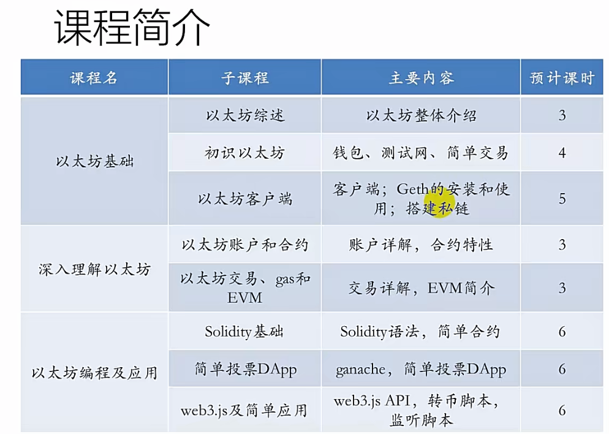
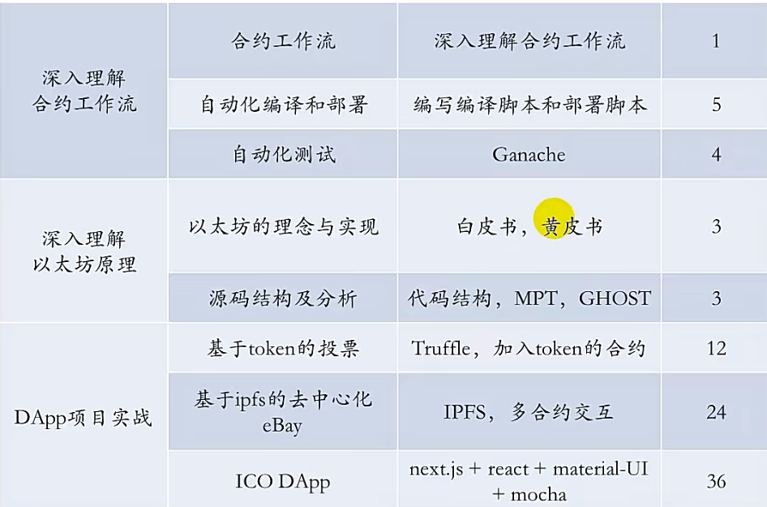

# 尚硅谷区块链技术之以太坊

## 01-以太坊理论

### 以太坊简介

**涉及工具**
- MetaMask-浏览器插件钱包
- Remix-基于浏览器的Solidity 在线编辑器
- (go语言)Geth-以太坊客户端
- web3.js-以太坊javascipt API库
- Ganache-以太坊客户端(测试环境私链)
- Truffle-以太坊开发框架

**环境准备**
- Chrome浏览器(最新版本70.0.3538.67)
- Linux系统或虚拟机(ubuntu16.04.3)
- 需要安装:go(1.9)，git(2.7.4),node(9.0.0),npm(5.7.1)
- 文本编辑器(VisualCode)
- 科学上网工具

### 1_以太坊综述
[1_以太坊综述](https://docs.qq.com/pdf/DU212dUJMR0pPU1R4)

#### **以太坊特点**
- 以太坊是“世界计算机”，这代表它是一个开源的、全球分布的计算基础设施
- 执行称为智能合约（smart contract）的程序
- 使用区块链来同步和存储系统状态以及名为以太币（ether）的加密货币，以计量和约束执行资源成本
- 本质是一个基于交易的状态机(transaction-based state machine)
- 以太坊平台使开发人员能够构建具有内置经济功能的强大去中心化应用程序（DApp）；在持续自我正常运行的同时，它还减少或消除了审查，第三方界面和交易对手风险

#### **以太坊的组成部分**

- **P2P网络**
 
以太坊在以太坊主网络上运行，该网络可在TCP端口30303上寻址，并运行一个名为
D三Vp2p的协议。

- **交易(Transaction)**

以太坊交易是网络消息，其中包括发送者(sender)，接收者(receiver)，值(value)和数据的有效载荷(payload)。

- **以太坊虚拟机(EVM)**

以太坊状态转换由以太坊虚拟机(EVM)处理，这是一个执行字节码(机器语言指令)的基于堆栈的虚拟机。

- **数据库(Blockchain)**

以太坊的区块链作为数据库(通常是 Google 的 LeveIDB)本地存储在每个节点上，包含序列化后的交易和系统状态。

- **客户端**

以太坊有几种可互操作的客户端软件实现，其中最突出的是 Go-Ethereum(Geth)和Parity

#### 以太坊中的重要概念
- **账户(Account)**
 
   包含地址，余额和随机数，以及可选的存储和代码的对象。
   1. 普通账户(EOA)，存储和代码均为空
   2. 合约账户(Contract)，包含存储和代码

- **地址(Address)**

   一般来说，这代表一个EOA或合约，它可以在区块链上接收或发送交易。更具体地说，它是ECDSA 公钥的 keccak 散列的最右边的160位。

- **交易(Transaction)**
  - 可以发送以太币和信息
  - 向合约发送的交易可以调用合约代码，并以信息数据为函数参数。向空用户发送信息，可以自动生成以信息为代码块的合约账户

- **gas**

  以太坊用于执行智能合约的虚拟燃料。以太坊虚拟机使用核算机制来衡量gas的消耗量并限制计算资源的消耗。

#### 以太坊的货币
以太坊的货币单位称为以太(ether)，也可以表示为ETH或符号三

以太币的发行规则:
- 挖矿前(Pre-mine，Genesis)
2014年7月18月间，为众筹大约发行了7200万以太币。这些币有的时候被称之为“矿前”。众筹阶段之后，以太币每年的产量基本稳定，被限制不超过7200万的25%
- 挖矿产出(Mining)
  - 区块奖励(block reward)
  - 叔块奖励(uncle reward)
  - 叔块引用奖励(uncle referencing reward)
- 以太币产量未来的变化
以太坊出块机制从工作量证明(PoW)转换为股权证明(PoS)后，以太币的发行会有什么变化尚未有定论。股权证明机制将使用一个称为Casper的协议。在Casper协议下，以太币的发行率将大大低于目前幽灵(GHOST)协议下的发行率

#### 以太坊的挖矿产出
- **区块奖励(Block rewards)**
每产生一个新区块就会有一笔固定的奖励给矿工，初始是5个以太币，现在是3个。
- **叔块奖励(Uncle rewards)**
有些区块被挖得稍晚一些，因此不能作为主区块链的组成部分。比特币称这类区块为“孤块”，并且完全舍弃它们。但是，以太币称它们为“叔块”(uncles)，并且在之后的区块中，可以引用它们。如果叔块在之后的区块链中作为叔块被引用，每个叔块会为挖矿者产出区块奖励的718。这被称之为叔块奖励。
- **叔块引用奖励(Uncle referencing rewards)**
矿工每引用一个叔块，可以得到区块奖励的1/32作为奖励(最多引用两个叔块)

这样的一套基于POW的奖励机制，被称为以太坊的“幽灵协议”

## 02-项目1:基于Token的硅谷投票系统

## 03-项目2: 硅谷拍卖系统（去中心话eBay）